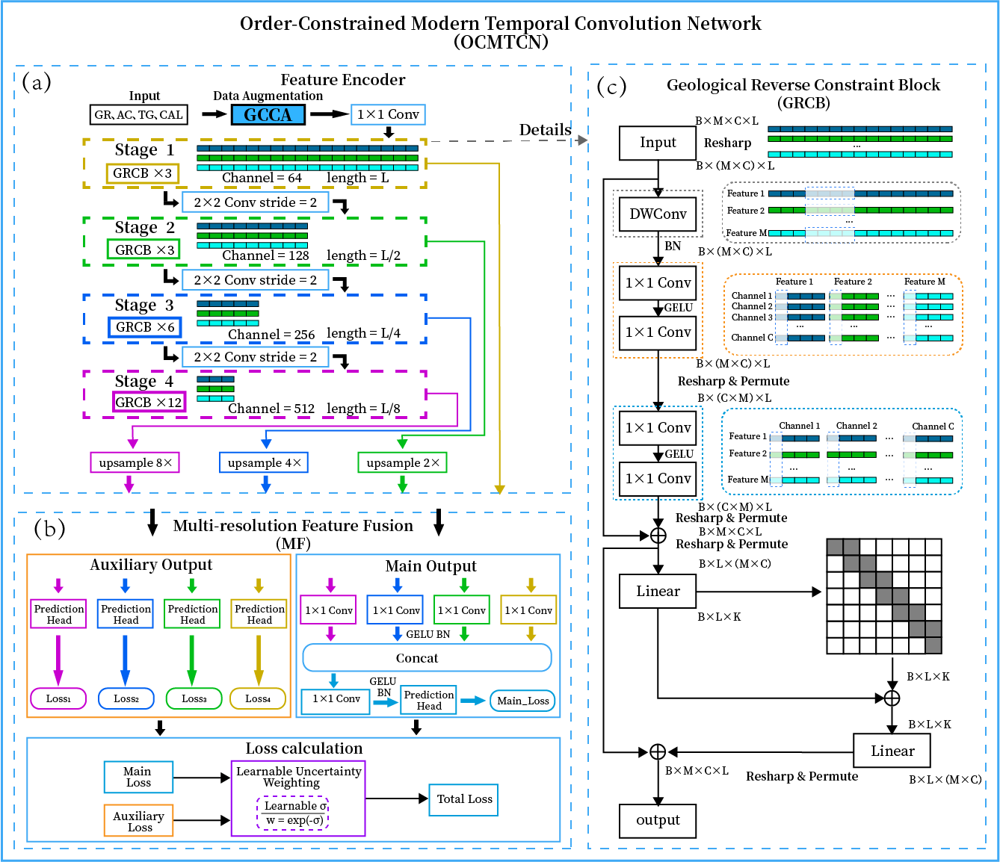

# \# OCMTCN

### 1\. Configure the environment

python == 3\.10\.20, pytorch \>= 2\.12\.0

pip install \-r requirements\.txt **\(some required dependencies\)**

### 2\. Project Overview

This project is based on the PyTorch deep learning framework and implements OCMTCN \(Order\-Consistent Multi\-Scale Temporal Convolutional Network\), which is applied to automatic stratigraphic identification of well logging data\.

### 3\. Project Structure

The overall file structure of the OCMTCN project is organized as follows:

```Plain Text
OCMTCN/
├── main.py                 # Main program entry, including training, verification and testing process
├── __init__.py
├── models/
│   └── OCMTCN.py          # OCMTCN model definition (including monotonic self-attention, CRF module, etc.)
├── OtherFile/
│   ├── config.yaml        # Core configuration file (hyperparameters, data paths, etc.)
│   ├── Tools.py           # Configuration reading tool
│   ├── Tool2.py           # Logging data preprocessing tool
│   ├── ModelTools.py      # Model evaluation tool (accuracy calculation, loss function, etc.)
│   ├── PlaintTools.py     # Result visualization and drawing tool
│   └── default.py         # Project default parameter configuration
```

### 4\. Configuration Parameters

All hyperparameters and running settings are defined in **OtherFile/config\.yaml**, the key parameters are shown below:

input\_path:       Well logging dataset folder path

    input\_feature:    Input logging feature columns \(e\.g\., GR, AC, QT, CNL\)

    window\_size:      Sliding window size \(default: 1024\)

    stride:           Sliding window step size \(default: 256\)

    batch\_size:       Training batch size \(default: 32\)

    epochs:           Maximum training iterations \(default: 500\)

    patience:         Early stopping patience value \(default: 30\)

    n\_splits:         K\-fold cross validation folds \(default: 5\)

    model:           Model type \(fixed as "OCMTCN"\)

    seed:             Global random seed \(default: 0\)

    is\_plaint:        Whether to generate visualization results \(true/false\)

    is\_add\_loss:      Whether to enable reverse order loss function \(true/false\)

    is\_plus:          Whether to enable data augmentation strategy \(true/false\)

    is\_muti:          Whether to enable multi\-resolution feature fusion \(true/false\)

    pic\_out\_path:     Output path of visualization images

### 5\. Model Training \& Inference

The entire training, verification and testing pipeline is encapsulated in**main\.py**\. Data processing, model evaluation and visualization functions are separately encapsulated in the tool files under the **OtherFile** folder\.

Run the project directly with the following command:

python main\.py

Specify single GPU for training and inference:

CUDA\_VISIBLE\_DEVICES=0 python main\.py

### 6\. Output Results

After the training is completed, the console will automatically print the following results:

\- Loss value and GPU running time of each epoch

    \- Accuracy of validation set

    \- Comprehensive evaluation metrics of test set \(accuracy, precision, recall, F1\-score, Kappa coefficient\)

    \- F1\-score and sample quantity of each lithology category

If **is\_plaint** is enabled, visualization results will be automatically generated in the **pic\_out\_path** directory, and the file structure is as follows:

```Plain Text
visualization_results/
├── WellName1/
│   ├── WellName1_Segment_1.png
│   └── ...
└── WellName2/
    └── ...
```
### 7\. Overview




### 8\. Note

The well logging dataset used in this project is confidential and cannot be uploaded to the GitHub repository\. However, we have provided complete data processing logic, parameter configuration and model running codes\. Users can replace the local data path in **config\.yaml** to complete model training and testing\.

> （注：部分内容可能由 AI 生成）
